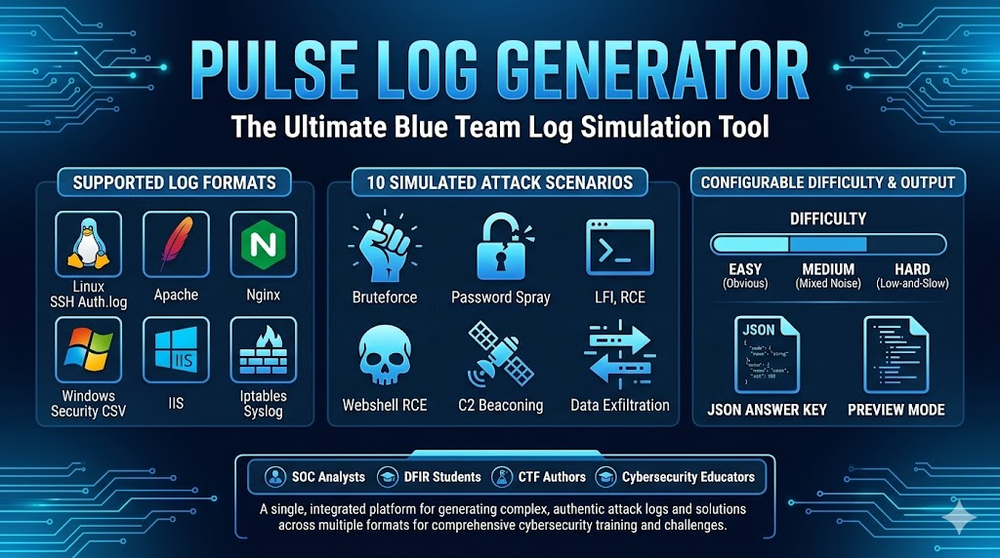

<p align="center">
  
</p>

<p align="center">
  <a href="https://www.python.org/downloads/"></a>
  <a href="https://flask.palletsprojects.com/"></a>
  <a href="LICENSE"></a>
  <a href="https://github.com/ChickenLoner/Pulse-log-generator/stargazers"></a>
  <a href="https://github.com/ChickenLoner/Pulse-log-generator/commits/main"></a>
</p>

<p align="center">
  <b>Pulse Log Generator</b> is a blue team training tool that produces realistic, scenario-based server logs for SOC analysts, DFIR students, and CTF challenge authors.
  <br>
  Generate authentic attack logs across <b>6 log formats</b> and <b>10 attack scenarios</b> with configurable difficulty levels and built-in JSON answer keys.
</p>

<p align="center">
  <a href="#-features">Features</a> •
  <a href="#-quick-start">Quick Start</a> •
  <a href="#-log-formats--scenarios">Log Formats</a> •
  <a href="#-usage">Usage</a> •
  <a href="#-advanced-overrides">Overrides</a> •
  <a href="#-project-structure">Structure</a>
</p>

---

## ✨ Features

| | Feature | Description |
|---|---|---|
| 📋 | **6 Log Formats** | Apache, Nginx, IIS W3C Extended, SSH auth.log, Windows Security Event Log, Firewall iptables |
| ⚔️ | **10 Attack Scenarios** | LFI, HTTP Bruteforce, Webshell RCE, SSH Bruteforce, Password Spray, Win Logon Bruteforce, Post-Exploitation, Port Scan, C2 Beaconing, Data Exfiltration |
| 🎚️ | **3 Difficulty Levels** | Easy (obvious, high-volume) · Medium (mixed noise) · Hard (low-and-slow, stealthy) |
| 🔑 | **Answer Keys** | Every generated file ships with a `_answers.json` key — attacker IPs, commands, compromised accounts |
| 👁️ | **Preview Mode** | Inspect the first 20 and last 10 lines before downloading |
| 🛠️ | **Advanced Overrides** | Customise attacker IPs, shell paths, endpoints, beacon intervals and more via JSON |

---

## ⚡ Quick Start

### Requirements

- Python **3.10+**
- [`uv`](https://github.com/astral-sh/uv) (recommended) or `pip`

### Installation

```bash
# 1. Clone
git clone https://github.com/ChickenLoner/Pulse-log-generator.git
cd Pulse-log-generator

# 2. Create virtual environment and install Flask
uv venv .venv
uv pip install flask

# 3. Run
.venv/bin/python server.py          # Linux / macOS / WSL
.venv\Scripts\python server.py      # Windows
```

Then open **http://localhost:5000** in your browser.

> **Tip:** If you don't have `uv`, replace steps 2–3 with `pip install flask && python server.py`

---

## 📋 Log Formats & Scenarios

| Log Format | File | Attack Scenarios |
|---|---|---|
| **Apache** | `access.log` | LFI, HTTP Bruteforce, Webshell RCE |
| **Nginx** | `nginx_access.log` | LFI, HTTP Bruteforce, Webshell RCE |
| **IIS W3C** | `u_exYYMMDD.log` | LFI, HTTP Bruteforce, Webshell RCE |
| **SSH auth.log** | `auth.log` | SSH Bruteforce, SSH Password Spray |
| **Windows Security** | `Security.csv` | Logon Bruteforce (4625/4624), Post-Exploitation (4688/4720/4732/7045) |
| **Firewall (iptables)** | `firewall.log` | Port Scan, C2 Beaconing, Data Exfiltration |

---

## 🚀 Usage

1. **Select a log type** from the six format cards
2. **Tick one or more attack scenarios** for that format
3. **Configure** noise line count, difficulty, attacker count, and time window
4. Click **Generate & Download** — you get a `.log` / `.csv` file and a `_answers.json` key
5. Or click **Preview** to inspect sample lines directly in the browser

---

## 🛠️ Advanced Overrides

Expand the **Advanced** panel and supply a JSON object to override any generator parameter:

```json
{
  "custom_attacker_ips": ["10.10.10.99", "203.0.113.5"],
  "lfi_endpoint":        "/view.php",
  "shell_path":          "/uploads/img/.thumb.php",
  "ssh_hostname":        "prod-web02",
  "ssh_compromised_user":"deploy",
  "fw_c2_ip":            "192.0.2.200",
  "fw_c2_port":          443,
  "fw_beacon_interval":  300,
  "fw_beacon_jitter":    20,
  "win_hostname":        "CORP-DC01",
  "win_backdoor_user":   "helpdesk99"
}
```

---

## 📁 Project Structure

```
Pulse-log-generator/
├── server.py               # Flask app — routes: GET /, POST /generate, GET /download
├── index.html              # Web UI
├── assets/
│   ├── app.js              # Frontend controller
│   └── style.css           # Styles
├── generators/
│   ├── config.py           # Constants, IP pools, log-format functions
│   ├── traffic.py          # Apache noise
│   ├── pages.py            # LFI — Apache
│   ├── auth.py             # HTTP Bruteforce — Apache
│   ├── cache.py            # Webshell RCE — Apache
│   ├── proxy.py            # All Nginx generators
│   ├── service.py          # All IIS generators
│   ├── remote.py           # All SSH generators
│   ├── events.py           # All Windows Event Log generators
│   └── netflow.py          # All Firewall generators
└── includes/               # Original PHP source (reference only)
```

---

## 👥 Who Is This For?

| Audience | Use Case |
|---|---|
| **SOC Analysts** | Practice log triage and alert investigation without production risk |
| **DFIR Students** | Sharpen timeline reconstruction and IOC identification skills |
| **CTF Authors** | Generate ready-to-use forensics challenge files with answer keys |
| **Cybersecurity Educators** | Create consistent, repeatable lab environments for courses |

---

## 📄 License

Released under the [MIT License](LICENSE) — see the file for details.

<p align="center">Made for the blue team 🔵</p>
